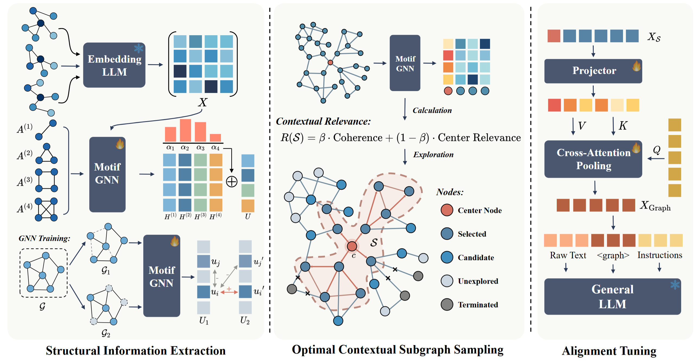

# GraspLLM

This repository hosts the official code for our paper:

>**GraspLLM: Towards Zero-Shot Generalization on Text-Attributed Graphs with LLMs**.

GraspLLM is a framework that combines <ins>**Gra**</ins>ph structural comprehension with the <ins>**s**</ins>emantic understanding <ins>**p**</ins>rowess of <ins>**LLM**</ins>s, enabling LLMs to perform zero-shot reasoning over Text-Attributed Graphs (TAGs) across diverse datasets and tasks.

<p align="center">
  
</p>

---

## 1. Setup

We use Python 3.12 / PyTorch 2.11 / CUDA 12.8.

```bash
conda create -n graspllm python=3.12 -y
conda activate graspllm

# PyTorch + CUDA 12.8 
pip install torch==2.11.0 --index-url https://download.pytorch.org/whl/cu128
pip install -r requirements.txt

pip install torch_geometric==2.6.1
pip install pyg_lib torch_scatter torch_sparse torch_cluster torch_spline_conv \
  -f https://data.pyg.org/whl/torch-2.11.0+cu128.html

pip install flash-attn --no-build-isolation
```

### Configure paths

```bash
export GRASPLLM_DATASET_ROOT=/path/to/datasets         # default: ./dataset
export GRASPLLM_MODELS_ROOT=/path/to/local_hf_models   # default: ./models
export GRASPLLM_CHECKPOINT_ROOT=/path/to/checkpoints   # default: ./checkpoints
```

---

## 2. Data Perparation and Repository Layout

### Data

We release the raw graphs of all 14 benchmarks on Hugging Face: **<https://huggingface.co/datasets/Heinz217/GraspLLM-Datasets>**.

```bash
huggingface-cli download Heinz217/GraspLLM-Datasets \
    --repo-type dataset --local-dir ./dataset
```

The expected layout for each dataset is:

```
$GRASPLLM_DATASET_ROOT/<name>/
├── processed_data.pt        # provided on HF
├── qwen3_emb_x.pt           # produced by Step 0 
├── ocs_train.jsonl          # produced by Stage 2
└── ocs_test.jsonl           # produced by Stage 2
```

A few sample Stage-2 outputs from Cora and Pubmed are included under `examples/` so you can inspect the optimal contextual subgraph sequence with chat-format prompt schema without running the full pipeline.

### Repository layout

```
GraspLLM/
├── README.md
├── requirements.txt
├── LICENSE
├── preprocess/ 
├── gnn/ 
├── model/ 
├── train/ 
├── eval/ 
├── utils/ 
├── examples/ 
└── scripts/ 
    ├── preprocess_emb.sh
    ├── stage1_gnn_pretrain.sh
    ├── stage2_generate_seqs.sh
    ├── stage3_train.sh
    ├── eval.sh
    ├── zero2.json
    └── zero3.json
```

---

## 3. End-to-end pipeline

We provide one clean script per stage. All scripts support both single-GPU and multi-GPU runs.

### Step 0 — Unified Semantic Encoding 

In this step, we utilize Qwen3-Embedding-8B to extract the node features.

```bash
# single GPU
bash scripts/preprocess_emb.sh cora 0

# multi-GPU sharding (4 cards, automatic merge)
bash scripts/preprocess_emb.sh arxiv 0,1,2,3
```

By default the encoder is resolved as `$GRASPLLM_MODELS_ROOT/Qwen3-Embedding-8B`. To use a custom location:

```bash
export QWEN3_EMB_MODEL=/abs/path/to/Qwen3-Embedding-8B
# or pass it per run
bash scripts/preprocess_emb.sh cora 0 --  
```

### Stage 1 — Motif-Aware Graph Self-Supervised Learning

Trains the dataset-agnostic motif GNN over the source TAGs. Output path:
`$GRASPLLM_CHECKPOINT_ROOT/structure_learner_qwen3.pth`.

```bash
GPU=0 bash scripts/stage1_gnn_pretrain.sh
# override defaults:
GPU=0 NUM_EPOCHS=300 LR=1e-4 \
DATASETS="arxiv pubmed computer history reddit" \
bash scripts/stage1_gnn_pretrain.sh
```

### Stage 2 — Optimal Contextual Subgraph Sampling

Runs the GNN-guided greedy node-selection algorithm to construct the
contextual subgraph (token sequence) for every center node.

```bash
GPU=0 bash scripts/stage2_generate_seqs.sh cora
# Force generation of an ocs_train.jsonl for a non-source dataset:
GPU=0 bash scripts/stage2_generate_seqs.sh cora --force-train
```

**Large-graph adaptation (opt-in).** For graphs with millions of nodes
(e.g. OGBN-Products), pass `--large-graph` to switch to a faithful but
heavily optimised implementation. 

```bash
# Single-GPU, fp16 (default, recommended):
GPU=0 bash scripts/stage2_generate_seqs.sh products --large-graph

# Disable fp16 (rare; only if you observe numerical issues):
GPU=0 bash scripts/stage2_generate_seqs.sh products --large-graph --no-fp16

# Add torch.compile:
GPU=0 bash scripts/stage2_generate_seqs.sh products --large-graph --compile
```

For multi-GPU sweeps and even tighter memory / speed budgets we ship three additional opt-in features in `gnn/seq_largegraph.py`. `--shared-emb` lets one owner GPU hold the full fp16 embedding while the others attach to it via CUDA IPC. `--center-batch K` processes `K` centers per GPU forward pass instead of one (default 1). `--emb-shard` row-shards the embedding across workers and uses NCCL all-gather.

### Stage 3 — Alignment Tuning

Trains the alignment projector on top of a frozen LLM backbone. Currently, we support four LLM backbones out of the box: **Vicuna-7B-v1.5**, **Mistral-7B-Instruct-v0.3**, **Llama-3.1-8B-Instruct**, and **Qwen3-8B / Qwen3-30B-A3B-Instruct (MoE)**.

Single-GPU:

```bash
bash scripts/stage3_train.sh \
    --backbone vicuna --source arxiv --gpus 0
```

Multi-GPU (DDP, 8 cards):

```bash
bash scripts/stage3_train.sh \
    --backbone vicuna --source arxiv --gpus 0,1,2,3,4,5,6,7
```

Multi-GPU with **DeepSpeed ZeRO-3**:

```bash
bash scripts/stage3_train.sh \
    --backbone qwen3-moe --source arxiv \
    --gpus 0,1,2,3,4,5,6,7 \
    --deepspeed scripts/zero3.json
```

### Zero-shot evaluation

Single-GPU:

```bash
bash scripts/eval.sh \
    --ckpt     checkpoints/grasp-vicuna-qwen3emb-vicuna_2layermh-arxiv \
    --backbone vicuna \
    --dataset  cora --gpu 0
```

Multi-GPU:

```bash
bash scripts/eval.sh \
    --ckpt     checkpoints/grasp-vicuna-qwen3emb-vicuna_2layermh-arxiv \
    --backbone vicuna \
    --dataset  photo --gpus 0,1,2,3
```

The script writes `<ckpt>/answers_<dataset>.jsonl` and prints accuracy on stdout.

---

## 4. Acknowledgements

This implementation builds on top of [LLaVA](https://github.com/haotian-liu/LLaVA) and [LLaGA](https://github.com/VITA-Group/LLaGA). We thank their authors for open-sourcing their work.
